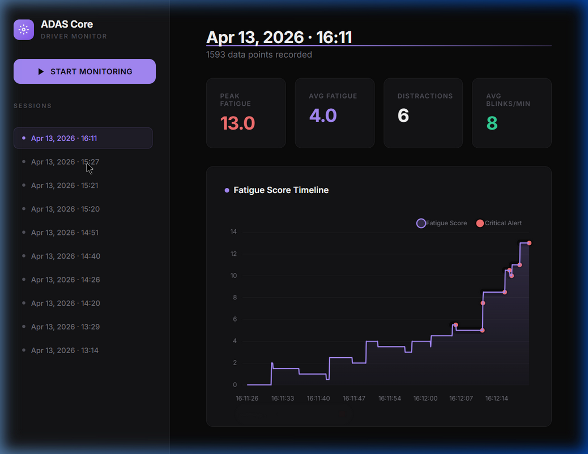

<p align="center">
  <h1 align="center">🚗 Driver Fatigue Detection System</h1>
  <p align="center">
    Real-time AI-powered driver monitoring with drowsiness detection, distraction alerts, and session analytics.
  </p>
</p>

<p align="center">
  
  
  
  
  
</p>

---

## 📸 Screenshots

<p align="center">
  
</p>
<p align="center"><em>Session analytics — fatigue score timeline with critical alert markers</em></p>

---

## ✨ Features

### Core Detection
| Feature | Method | Description |
|---------|--------|-------------|
| **Drowsiness Detection** | Eye Aspect Ratio (EAR) | Tracks prolonged eye closure and slow blinks using MediaPipe Face Mesh |
| **Yawn Detection** | Mouth Aspect Ratio (MAR) | Identifies yawning through mouth landmark geometry |
| **Head Pose Estimation** | 2D Facial Proportions | Detects head tilting (left, right, down) using nose-to-cheek ratios |
| **Gaze Tracking** | Iris Landmarks | Calculates horizontal pupil position to detect side-eye distractions |
| **Object Detection** | YOLOv8 Nano | Identifies cell phones, bottles, and cups in the driver's hands |

### System Architecture
- **🧵 Multithreaded AI Pipeline** — YOLOv8 runs asynchronously on a background thread, keeping the main camera loop at 30-60 FPS with zero frame drops
- **🎯 Adaptive Calibration** — 16-second startup sequence that calibrates EAR, MAR, and head pose thresholds to each individual driver
- **📊 Session Logging** — Automatic CSV logging with timestamps, all metrics, and alert events
- **🖥️ Web Dashboard** — Flask-based control center for launching the system and reviewing historical session analytics
- **🔊 Audio Alerts** — Looping alarm sound when drowsiness is detected, with async playback to avoid blocking

### Anti-False-Positive Protections
- **Signal Smoothing** — 5-frame moving average on EAR and MAR to filter camera noise
- **Head Pose Guard** — Blink tracking disabled when the head is turned (prevents false blinks from landmark distortion)
- **Blink Cooldown** — 200ms minimum gap between registered blinks
- **Event Debouncing** — 3-second cooldown prevents the same event from being penalized twice (e.g., camera jitter re-triggering a yawn)
- **Decoupled Timers** — Natural score decay runs on its own clock, unaffected by other penalty timers

---

## 🏗️ Architecture

```
┌──────────────────────────────────────────────────────┐
│                  dashboard.py (Flask)                 │
│            Web UI · Launch · Log Viewer               │
└───────────────────┬──────────────────────────────────┘
                    │ subprocess.Popen
                    ▼
┌──────────────────────────────────────────────────────┐
│                    main.py                            │
│         Calibration → Main Loop → Shutdown            │
├──────────┬────────────┬──────────┬───────────────────┤
│  face_   │  fatigue_  │ object_  │                   │
│detection │ detection  │detection │    alerts.py       │
│  .py     │   .py      │  .py     │  Audio + HUD      │
│          │            │ (Thread) │                   │
│ MediaPipe│ EAR/MAR/   │ YOLOv8   │                   │
│ FaceMesh │ HeadPose/  │ Async    │                   │
│          │ Gaze/Score │ Scanner  │                   │
├──────────┴────────────┴──────────┴───────────────────┤
│                    logger.py                          │
│              CSV Session Recording                    │
└──────────────────────────────────────────────────────┘
```

---

## 🚀 Getting Started

### Prerequisites
- Python 3.10+
- Webcam
- Windows OS (uses `winsound` for audio alerts)

### Installation

```bash
# Clone the repository
git clone https://github.com/AmozRich/Driver-Fatigue.git
cd Driver-Fatigue

# Install dependencies
pip install -r requirements.txt
```

### Usage

```bash
# Start the web dashboard (recommended)
python dashboard.py
```

Then open **http://localhost:5000** in your browser and click **START MONITORING**.

The system will:
1. Open a calibration sequence (16 seconds) — follow the red dot
2. Begin real-time monitoring with an on-screen HUD
3. Log all data to `logs/session_<timestamp>.csv`
4. Press `q` to quit the monitoring window

You can also run the monitoring directly without the dashboard:

```bash
python main.py
```

---

## 📁 Project Structure

```
driver-fatigue/
├── main.py                 # Entry point — calibration + main loop
├── dashboard.py            # Flask web server + API
├── face_detection.py       # MediaPipe Face Mesh wrapper
├── fatigue_detection.py    # Core detection logic (EAR, MAR, gaze, head pose)
├── object_detection.py     # Threaded YOLOv8 distraction detector
├── alerts.py               # Audio alerts + OpenCV HUD overlays
├── logger.py               # CSV session recorder
├── utils.py                # Constants, thresholds, helper functions
├── templates/
│   └── index.html          # Web dashboard UI
├── logs/                   # Auto-generated session CSVs
├── assets/                 # README screenshots
├── yolov8n.pt              # YOLOv8 Nano weights (auto-downloaded)
└── requirements.txt
```

---

## ⚙️ Configuration

Key thresholds in `utils.py` — tuned for ~30 FPS:

| Constant | Default | Description |
|----------|---------|-------------|
| `EAR_THRESHOLD` | 0.22 | Eyes considered closed below this |
| `MAR_THRESHOLD` | 0.50 | Yawning detected above this |
| `DROWSINESS_FRAMES` | 45 | ~1.5s of closed eyes triggers alert |
| `SLOW_BLINK_FRAMES` | 12 | ~0.4s blink = drowsy blink |
| `YAWN_FRAMES` | 20 | ~0.7s sustained mouth opening |
| `HEAD_TILT_FRAMES` | 40 | ~1.3s head turn to trigger penalty |
| `FATIGUE_SCORE_LIMIT` | 5.0 | Score threshold for full alarm |

---

## 📊 Fatigue Scoring System

The system uses a **persistent, accumulative fatigue score** that rises with unsafe behaviors and naturally decays during attentive driving.

| Event | Points | Condition |
|-------|--------|-----------|
| Prolonged eye closure | +3.0 | Eyes closed for >1.5 seconds |
| Yawning | +2.0 | Mouth open wide for >0.7 seconds |
| Head tilt away | +2.0 | Head turned for >1.3 seconds |
| Slow blink | +1.0 | Single blink lasting >0.4 seconds |
| Distracted gaze | +1.0 | Side-eye sustained for >0.7 seconds |
| Hyper-blinking | +0.2 | >40 blinks per minute |
| Natural decay | −0.5 | Every 5 seconds of attentive driving |

**Status Levels:**
- 🟢 **Alert** — Score < 2.5
- 🟡 **Warning** — Score ≥ 2.5
- 🔴 **DROWSINESS ALERT** — Score ≥ 5.0 (triggers alarm)

---

## 🛠️ Tech Stack

- **[MediaPipe](https://mediapipe.dev/)** — Real-time face mesh with 478 landmarks including iris tracking
- **[YOLOv8](https://docs.ultralytics.com/)** — Object detection for physical distractions (phone, bottle, cup)
- **[OpenCV](https://opencv.org/)** — Video capture, processing, and HUD rendering
- **[Flask](https://flask.palletsprojects.com/)** — Lightweight web server for the dashboard
- **[Chart.js](https://www.chartjs.org/)** — Interactive session analytics graphs

---

## 📝 License

This project is for educational and research purposes.

---

<p align="center">
  Built with ❤️ for safer roads
</p>
